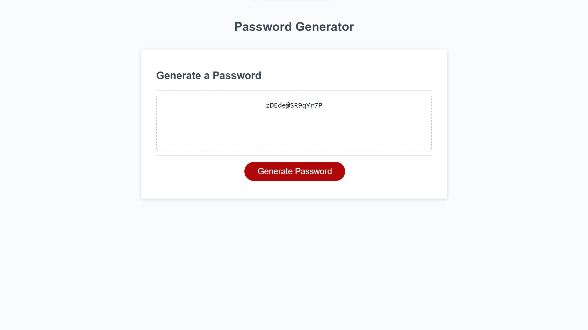

# Random Password Generator

https://chairsitter.github.io/RandomPasswordChallenge/

## Description

This password generator uses alert, confirm, and prompt window messages to guide the user in creating a randomized password from 8-128 characters long, 
based on user preferences on whether lowercase letters, uppercase letters, numbers, and special characters will be included. 
The application validates entries to ensure only a password length value within the specified range is accepted, and that at least one available 
character bank is chosen. The generator posts the random password into a text area in the webpage, and the full functionality can be used repeatedly afterwards. 

- This application helps a user create a very secure password of chosen length to satisfy the requirements of most password systems. 
- I built this project to practice interaction of JavaScript with HTML, use of random functionality in JavaScript, and manipulation of arrays, as well as
organization and effective interaction of multiple functions to create an application that can be used repeatedly in a single page load.
- By completing this project, I learned about alert, confirm, and prompt boxes and how to use them to collect user input. I learned some techniques for
combining arrays, and organizing variables and functions in JavaScript code to make the code repeatable. 

## Usage

To use this application, the user can click the Generate Password button, then follow window prompts to select a length, and choose whether or 
not to include up to 4 banks of characters (but at least 1 bank) for their fully randomized password. The user will receive the password in the text area
field, and can then highlight and copy the password. It is recommended that the user saves the password or writes it down, as these passwords are 
very secure and difficult to remember. 

## Credits

Credit for the main design of this project, and the HTML, CSS, and around 50% of the JavaScript code, goes to the UNC Coding Bootcamp. 